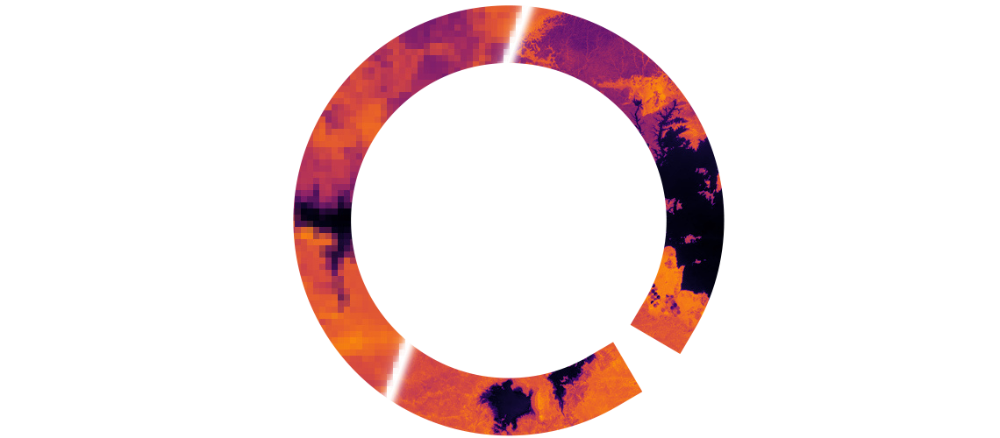

[](https://paperswithcode.com/sota/multi-frame-super-resolution-on-proba-v?p=wide-activation-for-efficient-and-accurate) [](https://opensource.org/licenses/Apache-2.0)

<h1 align="center"> ~ Multi-Image Super-Resolution Task ~ </h1>



Are you a Deep Learning practitioner, but you are tired of dealing with Cats and Dogs datasets? Do you want to work on a real problem with a high impact on the research community, but it is always tricky to get your hand's on the final preprocessed data? If that's the case, you are in the right place!

We created this repository for two primary reasons:

- Give easy access to a unique [dataset](https://kelvins.esa.int/proba-v-super-resolution/data/), introduced by ESA in 2019, to work on the very challenging task of multi-frame super-resolution. If you've never heard about this computer vision task, [this survey](https://ieeexplore.ieee.org/abstract/document/8782382) could help you. Anyway, in a few words, its aim is pretty intuitive and straightforward: reconstruct a high-resolution image from a set of low-resolution frames. So, with a practical and easy to use [jupyter notebook](https://github.com/EscVM/RAMS/blob/master/preprocessing_dataset.ipynb) we give you the possibility to preprocess this [dataset](https://kelvins.esa.int/proba-v-super-resolution/data/) and dive directly into the design of your methodology. It's a very flexible pipeline where all steps can be easily omitted. All data are included with this repository, already split in train validation and testing. At the end of the process you will have three primary tensors: **X** with shape (B, 128, 128, T), **y** with shape (B, 384, 384, 1), and **y_mask** with shape (B, 384, 384, 1) with the quality maps of the ground-truths in y. Your task is straightforward...find a way to turn X into y. In other words, fuse the T images at 128x128, for each scene B, and get a corresponding image 384x384 at the triple of the resolution. It's a very challenging and fascinating task with a significant impact on the work of many peer researchers, but not yet so investigated.

- Give access to our pre-trained solution (RAMS) that me and [fsalv](https://github.com/fsalv) in a joint effort we have conceptualized and implemented. We've tested and proved our ideas with a joint account under the name of our robotics lab [PIC4SeR](https://pic4ser.polito.it/) in the post-mortem challenge of the [ESA website](https://kelvins.esa.int/proba-v-super-resolution-post-mortem/leaderboard/) achieving by far the first position. Yes, because what is beautiful about this dataset is that you can still prove your effort submitting your results directly on the [ESA website](https://kelvins.esa.int/proba-v-super-resolution-post-mortem/home/). On the other hand, you can use the validation we provide inside this repository to directly compare your signs of progress with the [original winner](https://github.com/diegovalsesia/deepsum) of the ESA challenge (there are the same scenes used in their paper). So, in any case, you will have direct feedback on your efforts and prove your ability with machine learning and deep learning projects!

<p align="center">

</p>

# 1.0 Getting Started with the Installation
Python3 and Tensorflow 2.x are required required and should be installed on the host machine following the [official guide](https://www.tensorflow.org/install).


1. Clone this repository

   ```bash
   git clone https://github.com/EscVM/RAMS
   ```
2. Install the required additional packages 
   ```
   pip3 install -r requirements.txt
   ```
# 2.0 Pre-Processing Notebook
Use the [pre-processing](https://github.com/EscVM/RAMS/blob/master/preprocessing_dataset.ipynb) notebook to process the Proba-V [original dataset](https://kelvins.esa.int/proba-v-super-resolution/data/) and obtain the training/validation/testing arrays ready to be used.

**NB**: Testing is the original ESA testing dataset without ground truths. Validation is the portion of the dataset we've used to test our solution and all major multi-image super-resolution methodologies. However, you can still use the testing dataset and the [post-mortem](https://kelvins.esa.int/proba-v-super-resolution-post-mortem/home/) ESA website to evaluate your technique.

# 3.0 Training Notebook
Use the [training notebook](https://github.com/EscVM/RAMS/blob/master/train_RAMS_network.ipynb) to re-train the original or modified version of the RAMS architecture.

# 4.0 Testing Notebook
Use the [testing notebook](https://github.com/EscVM/RAMS/blob/master/test_RAMS_network.ipynb) to test RAMS model, with pre-trained or re-trained weights, over the validation set. Moreover, you can use the final chapter of the notebook to make predictions with the original ESA testing set, create a zip file and submit it to the [post-mortem](https://kelvins.esa.int/proba-v-super-resolution-post-mortem/home/) website.
The following table gives you a reference with results achieved by the RAMS architecture and all literature major solutions over the validation set.
<p align="center">

</p>
